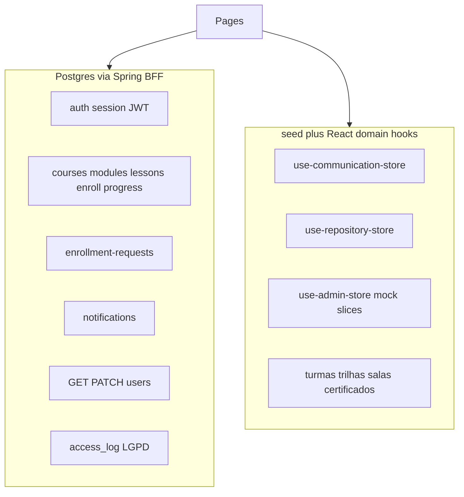

<!-- BEGIN:nextjs-agent-rules -->
# This is NOT the Next.js you know

This version has breaking changes — APIs, conventions, and file structure may all differ from your training data. Read the relevant guide in `node_modules/next/dist/docs/` before writing any code. Heed deprecation notices.
<!-- END:nextjs-agent-rules -->

## Data wiring

Inventário para não tratar mock como backend real. Detalhes de produto e rotas: [README.md — Limitações do MVP](README.md#limitações-do-mvp--o-que-não-vender-como-pronto).

| Área | Persistência | Flag / gate |
|------|--------------|-------------|
| Auth (login, JWT, sessão) | Postgres via Spring | `NEXT_PUBLIC_USE_JAVA_API=true` |
| Aprendizagem core (cursos, módulos, aulas, matrículas, progresso, solicitações) | Postgres via BFF `/api/lms/*` | idem; React Query em `src/lib/lms/` |
| Notificações | Postgres | idem (`use-notifications-store`) |
| Admin usuários (`GET/PATCH /api/v1/users`) | Postgres | idem; página `/administracao` |
| **11 slices FE-1** (`posts`, `questions`, `evaluations`, `contents`, `destaques`, `alertRules`, `internalMails`, `automations`, `integrations`, `permissions`, `scheduledJobs`) | **Mock** — `seed.*` + estado React | Domain hooks FE-4: `use-communication-store`, `use-repository-store`, `use-admin-store`; `// MOCK` nos slices; rotas ocultas em prod via `mock-module-gates.ts`. Migração Java: [FE-5](docs/fe-5-mock-to-java-migration.md) |
| Aprendizagem demo (turmas, trilhas, salas, certificados, interesses) | **Mock** | `use-learning-store.ts` quando Java API off ou campos sem endpoint |
| Outros mock admin (`users` lista local, `messages`, `auditLogs`, `settings`) | **Mock** | `use-admin-store` / communication; admin Java de usuários usa API direta |
| Preferências UI | localStorage | `use-auth-store` |

