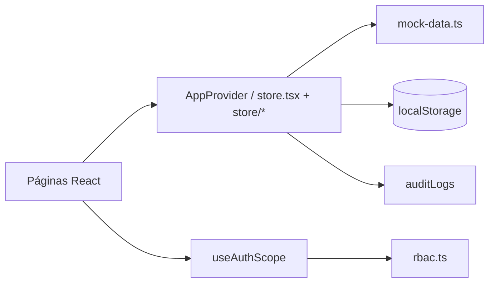

# Plataforma para Sistema Inteligente — Fase 1

**Navoxi** — plataforma corporativa de **gestão de aprendizagem, conteúdos e operações**.

Este repositório entrega a **Fase 1** (auth, cursos, matrículas, progresso, admin de usuários com API Java) e, em desenvolvimento local, **UI de demonstração (Fase 2 / mock)** para módulos ainda não persistidos. Em **produção**, as rotas mock ficam ocultas por padrão — não vender preview como produto pronto.

## Stack

| Camada | Tecnologia |
|---|---|
| Front | [Next.js 16](https://nextjs.org/) (App Router) + React 19 + TypeScript |
| Estilo | Tailwind CSS v4 · kit local [`src/components/ui.tsx`](src/components/ui.tsx) (parecer shadcn: [`docs/fe-7-ui-kit-migration.md`](docs/fe-7-ui-kit-migration.md)) |
| Estado UI | React Context (`src/lib/store.tsx` + `src/lib/store/*` por domínio) |
| Backend (Fase 1) | Java 21 + Spring Boot em [`backend/`](backend/) |
| Persistência API | H2 (local) / PostgreSQL + Flyway (prod) |
| Fallback demo | Mock em `src/lib/mock-data.ts` quando `NEXT_PUBLIC_USE_JAVA_API` ≠ `true` |

### Backend Java (opcional)

```bash
cd backend
mvn spring-boot:run -Dspring-boot.run.profiles=local
```

Templates sem secrets: [`.env.example`](.env.example) (Next → copiar para `.env.local`) e [`backend/.env.example`](backend/.env.example) (Spring).

No front (`.env.local`):

```env
NEXT_PUBLIC_USE_JAVA_API=true
LMS_API_URL=http://localhost:8080
LMS_API_TOKEN=local-dev-token
AUTH_SECRET=dev-secret-change-me
ALLOW_DEMO_LOGIN=true
```

O browser chama só `/api/lms/*` e `/api/auth/*` (BFF). O token Java nunca vai para o cliente.

Login por senha: `POST /api/auth/login` → backend Java (`BCrypt`). Fallback mock local só fora de produção, com `ALLOW_DEMO_LOGIN` ≠ `false` e backend indisponível.

Credenciais seed e senha local: só em [`docs/local-dev-auth.md`](docs/local-dev-auth.md) (não publicar em deploy aberto). Backend: [`backend/README.md`](backend/README.md).

## Início rápido

```bash
npm install
npm run dev
```

Abra [http://localhost:3000](http://localhost:3000). Com backend Java rodando, use e-mail cadastrado + senha seed — ver [`docs/local-dev-auth.md`](docs/local-dev-auth.md).

Build de produção:

```bash
npm run build
npm start
```

## Autenticação

Desenvolvimento local (contas seed, senha demo, envs): [`docs/local-dev-auth.md`](docs/local-dev-auth.md).

Em **produção** (`NODE_ENV=production`):

- Login mock / senha compartilhada fica **hard-disabled** — `ALLOW_DEMO_LOGIN` / `AUTH_DEMO_ENABLED` são ignorados
- Contas seed de demo não autenticam por senha (Next + `LMS_BLOCK_DEMO_SEED_LOGINS` no backend)
- Caminhos permitidos: Microsoft Entra (SSO) e break-glass BCrypt para contas reais (`local`/`both`) já provisionadas

### Checklist produção pública

- `NODE_ENV=production` (demo login impossível mesmo com flags)
- `ALLOW_DEMO_LOGIN` / `AUTH_DEMO_ENABLED` — não setar (ignorados em prod)
- `LMS_SEED_ENABLED=false`
- `LMS_BLOCK_DEMO_SEED_LOGINS=true` (default no profile `prod` do backend)
- `LMS_JIT_PROVISIONING=true` (default no profile `prod`)
- `LMS_ALLOWED_EMAIL_DOMAINS` + `AUTH_ALLOWED_EMAIL_DOMAIN` (mesmo domínio)
- `LMS_BOOTSTRAP_ADMIN_EMAILS` (primeiro admin real — via secret/env, não no README)
- `LMS_JWT_SECRET` (≥32 chars; obrigatório em prod)
- `LMS_API_TOKEN` forte (≥24 chars; **não** `local-dev-token` — fail-fast)
- `CORS_ORIGINS` com URL do front (obrigatório no profile `prod`)
- Seed desligado; se precisar senha inicial, use secret forte fora do repositório
- Microsoft Entra com tenant específico (`AZURE_AD_TENANT_ID`, não `common`)
- **Não** setar `NEXT_PUBLIC_SHOW_MOCK_MODULES` em produção pública (default: módulos mock ocultos)
- **Não** documentar e-mails/senhas admin no README público se o deploy estiver aberto

### Headers (CSP)

O Next envia Content-Security-Policy via [`next.config.ts`](next.config.ts), com allowlist para YouTube (player embutido) e Microsoft Entra. Em `development` o header é **Report-Only** (não quebra HMR); em produção é **enforce**. `script-src` inclui `'unsafe-inline'` e `'unsafe-eval'` (IFrame API do YouTube). Follow-up: nonces / reduzir `unsafe-*`.

### Fase 1 pronta (vendável)

Com `NEXT_PUBLIC_USE_JAVA_API=true` + backend Java:

- Login senha (BCrypt) e Microsoft Entra (SSO)
- Cursos, módulos, aulas, progresso
- Matrículas e solicitações de matrícula
- Notificações (API)
- Administração de usuários (listagem/promoção via API)

### Demo UI / Fase 2 (mock — oculto em produção)

Rotas abaixo usam seed/`localStorage` e **não** têm backend Java. Em `NODE_ENV=production` ficam bloqueadas (nav + deep link → redirect `/dashboard`), salvo `NEXT_PUBLIC_SHOW_MOCK_MODULES=true` (staging/demo controlada).

| Rota | Status |
|---|---|
| `/auditoria` | Mock (export sem handler; IP seed `10.2.31.5`) |
| `/configuracoes` | Mock |
| `/comunicacao` | Mock |
| `/integracoes` | Mock (SSO/RH/BI só UI) |
| `/aprendizagem/certificados` | Mock |
| `/aprendizagem/avaliacoes` | Mock |
| `/administracao` | **Fase 1** com Java API; oculto em prod se `NEXT_PUBLIC_USE_JAVA_API` ≠ `true` |

O perfil e a unidade vêm do cadastro do usuário. Menus, rotas e dados são filtrados automaticamente conforme **RBAC**, escopo de unidade e o gate de módulos mock (`src/lib/mock-module-gates.ts`).

## Visão geral dos módulos

### Geral

| Rota | Descrição |
|---|---|
| `/dashboard` | KPIs, atalhos, destaques, filtros (unidade, categoria, público-alvo, modalidade), abas Dashboard / Equipe |
| `/notificacoes` | Central de notificações com detalhamento |
| `/perfil` | Dados do usuário autenticado |
| `/preferencias` | Tema, idioma e preferências de notificação |

### Administração e identidade

| Rota | Requisitos | Status | Descrição |
|---|---|---|---|
| `/identidade` | Admin Premium | Preview / parcial | Perfis, matriz de permissões, políticas de segurança, sessões |
| `/administracao` | Admin Premium / Unidade | **Fase 1** (com Java API) | Gestão de usuários, busca, departamentos |

### Aprendizagem

| Rota | Status | Descrição |
|---|---|---|
| `/aprendizagem/catalogo` | Fase 1 | Catálogo navegável + aba **Minhas inscrições** |
| `/aprendizagem/cursos` | Fase 1 | CRUD de cursos + importação de aulas via YouTube |
| `/aprendizagem/cursos/[courseId]` | Fase 1 | Player de aulas e progresso |
| `/aprendizagem/turmas` | Fase 1 / parcial | Gestão de turmas vinculadas a cursos e salas |
| `/aprendizagem/trilhas` | Preview | Trilhas com etapas sequenciais e progresso |
| `/aprendizagem/calendario` | Preview | Calendário acadêmico de eventos |
| `/aprendizagem/biblioteca` | Preview | Biblioteca de materiais de aprendizagem |
| `/aprendizagem/salas` | Preview | Cadastro de salas e recursos presenciais |
| `/aprendizagem/certificados` | **Demo UI / Fase 2** | Emissão e gestão de certificados (mock) |
| `/aprendizagem/interesses` | Preview | Registro de interesse em cursos futuros |
| `/aprendizagem/solicitacoes` | Fase 1 | Aprovação/rejeição de solicitações de matrícula |
| `/aprendizagem/avaliacoes` | **Demo UI / Fase 2** | Avaliações (mock) |

**Modalidades suportadas:** EAD/online, presencial e híbrido.

**Fluxo de inscrição em cursos**

1. Aluno acessa **Catálogo** e clica em **Inscrever-se**.
2. Se o curso tiver turmas, seleciona a turma disponível (com verificação de vagas).
3. Com **aprovação obrigatória** ativa em Configurações → cria solicitação pendente.
4. Gestor aprova em **Solicitações** → matrícula efetivada e notificação enviada.
5. Sem aprovação → matrícula imediata, contadores de inscritos atualizados.
6. A aba **Inscrições** (`/aprendizagem/catalogo?tab=inscricoes`) lista matrículas ativas, concluídas e canceladas.
7. Alunos matriculados acessam **Continuar curso** → player em `/aprendizagem/cursos/[courseId]`; progresso = aulas concluídas ÷ total de aulas.

### Vídeos YouTube (importação de aulas)

Gestores podem importar playlists do YouTube na edição de um curso. A reprodução usa a YouTube IFrame Player API com títulos customizados da plataforma (sem exibir metadados do YouTube ao aluno).

Configure a chave da YouTube Data API v3 em `.env.local`:

```bash
YOUTUBE_API_KEY=sua_chave_aqui
```

Reinicie o servidor (`npm run dev`) após adicionar a variável. Sem a chave, o player de aulas seed continua funcionando; apenas a importação de novas playlists fica indisponível.

### Login com Microsoft (Entra ID)

Na tela de login há a opção **Entrar com Microsoft**, com identidade verificada via OAuth 2.0 e Microsoft Graph.

No [portal Azure](https://portal.azure.com) → **Microsoft Entra ID** → **Registros de aplicativo** → novo app:

1. **URI de redirecionamento (Web):** `https://seu-dominio/api/auth/microsoft/callback` (local: `http://localhost:3000/api/auth/microsoft/callback`)
2. Crie um **Segredo do cliente**
3. Permissões delegadas: `openid`, `profile`, `email`, `User.Read`

Variáveis em `.env.local` (e no Railway → Variables):

```bash
AZURE_AD_CLIENT_ID=seu_client_id
AZURE_AD_CLIENT_SECRET=seu_client_secret
AZURE_AD_TENANT_ID=common
AUTH_SECRET=string_aleatoria_longa
NEXT_PUBLIC_APP_URL=https://neoenergia-lms-production.up.railway.app
```

`AZURE_AD_TENANT_ID=common` aceita contas Microsoft corporativas e pessoais; use o ID do tenant da organização para restringir ao domínio da empresa.

### Conteúdo e avaliações

| Rota | Descrição |
|---|---|
| `/repositorio` | Upload e gestão de conteúdos (vídeo, PDF, SCORM, imagem, link) com campo de uso |
| `/repositorio/questoes` | Banco de questões (múltipla escolha, verdadeiro/falso, dissertativa) |

### Comunicação

| Rota | Status | Descrição |
|---|---|---|
| `/comunicacao` | **Demo UI / Fase 2** | Destaques, posts, alertas, correio e campanhas (mock) |

O banner de destaques no dashboard pode ser ligado/desligado em **Configurações → Interface** (só em ambiente com mocks visíveis).

### Inteligência e sistema

| Rota | Status | Descrição |
|---|---|---|
| `/relatorios` | Preview | KPIs e gráficos |
| `/configuracoes` | **Demo UI / Fase 2** | Parâmetros gerais, módulos, interface (mock) |
| `/integracoes` | **Demo UI / Fase 2** | SSO, RH, BI, webhooks (mock) |
| `/auditoria` | **Demo UI / Fase 2** | Trilha de auditoria mock; export sem handler |

## Controle de acesso (RBAC)

Definido em `src/lib/rbac.ts`. Cada perfil possui um conjunto de permissões; rotas e itens de menu exigem permissões específicas.

| Perfil | Escopo principal |
|---|---|
| **Administrador Premium** | Todas as unidades, configurações globais, identidade, integrações, auditoria |
| **Administrador de Unidade** | Usuários, turmas, conteúdos e relatórios da própria unidade |
| **Gestor de Conteúdo** | Repositório, cursos e consumo de aprendizagem |
| **Instrutor** | Cursos, turmas e consumo de aprendizagem |
| **Aluno** | Catálogo, inscrições, trilhas, calendário e biblioteca |

**Unidades:** Navoxi · Matriz, Nordeste, Sul e Centro-Oeste.

O hook `useAuthScope()` (`src/lib/use-auth-scope.ts`) aplica o filtro por unidade nos dados retornados ao componente.

## Parametrização da plataforma

Em `/configuracoes` é possível alterar (persistido no estado da aplicação):

- Nome da organização, idioma, fuso horário
- Regras de segurança (MFA, tamanho mínimo de senha)
- **Aprovação de matrícula** (`approvalRequired`) — impacta o fluxo de inscrição
- Identidade visual (cor da marca)
- **Módulos habilitados** — ocultam itens do menu lateral
- **Layout** — sidebar ou menu superior, densidade, exibição de destaques
- Matriz de permissões por perfil
- Jobs agendados (sincronização RH, lembretes, relatórios)

## Arquitetura

```
src/
├── app/
│   ├── login/                      # Autenticação (Entra + senha)
│   ├── page.tsx                    # Redirecionamento para login ou dashboard
│   └── (app)/                      # Shell autenticado (sidebar + header)
│       ├── dashboard/
│       ├── identidade/
│       ├── administracao/
│       ├── aprendizagem/           # 12 sub-rotas (catálogo, cursos, turmas…)
│       ├── repositorio/
│       ├── comunicacao/
│       ├── relatorios/
│       ├── configuracoes/
│       ├── integracoes/
│       ├── auditoria/
│       ├── notificacoes/
│       ├── perfil/
│       └── preferencias/
├── components/
│   ├── Sidebar.tsx                 # Navegação lateral (padrão)
│   ├── TopNav.tsx                  # Navegação superior (opcional)
│   ├── Header.tsx
│   ├── RouteGuard.tsx              # Proteção de rotas por permissão
│   ├── ui.tsx                      # Modal, Button, Card, Table…
│   ├── dashboard/                  # Filtros, widgets, aba Equipe
│   └── home/                       # Atalhos, destaques, ações rápidas
└── lib/
    ├── types.ts                    # Tipos de domínio
    ├── mock-data.ts                # Seed de demonstração
    ├── store.tsx                   # Fachada AppProvider / useApp
    ├── store/                      # Domínios: auth, learning, notifications
    │   ├── types.ts
    │   ├── shared.ts
    │   ├── use-auth-store.ts
    │   ├── use-learning-store.ts
    │   └── use-notifications-store.ts
    ├── rbac.ts                     # Perfis, permissões, menu
    ├── use-auth-scope.ts           # Escopo por unidade/perfil
    ├── aprendizagem.ts             # Labels (modalidade, status…)
    ├── dashboard-metrics.ts        # Cálculo de KPIs do dashboard
    └── platform-config.ts          # Tema / cor da marca
```

### Fluxo de dados



Toda mutação relevante (criar curso, inscrever aluno, alterar configuração) atualiza o estado em memória e registra entrada na **Auditoria**.

## Entidades principais (mock)

| Entidade | Uso |
|---|---|
| `User` | Colaboradores e perfis de acesso |
| `Course` / `Turma` / `Trilha` | Oferta de aprendizagem |
| `InscricaoCurso` | Matrículas efetivadas |
| `SolicitacaoMatricula` | Pedidos aguardando aprovação |
| `Certificado` | Emissão pós-conclusão |
| `Question` / `Evaluation` | Avaliações vinculadas a curso/turma |
| `ContentAsset` | Repositório de mídias |
| `Post` / `Destaque` / `InternalMail` | Comunicação interna |
| `Integration` / `Automation` / `ScheduledJob` | Integrações e automações |
| `AuditLog` / `Notification` | Auditoria e alertas |

## Limitações do MVP / o que não vender como pronto

A **Fase 1** tem backend Java real para auth, aprendizagem core e admin de usuários. O restante abaixo é **demo UI** (seed / estado local) e fica **oculto em produção** sem `NEXT_PUBLIC_SHOW_MOCK_MODULES=true`. Slices mock-only vivem nos domain hooks FE-4 (`use-communication-store` / `use-repository-store` / `use-admin-store`), marcados com `// MOCK: not wired to backend`; inventário em [`AGENTS.md`](AGENTS.md#data-wiring). Playbook de migração mock → Java (FE-5): [`docs/fe-5-mock-to-java-migration.md`](docs/fe-5-mock-to-java-migration.md).

| Aspecto | Estado atual |
|---|---|
| Autenticação | Senha BCrypt (backend) + Microsoft Entra; JWT de usuário nas rotas de dados |
| Aprendizagem core | API Java (cursos, matrículas, progresso) quando `NEXT_PUBLIC_USE_JAVA_API=true` |
| Auditoria / Config / Comunicação / Integrações | Mock — não persistidos; auditoria com IP seed fixo e export sem handler |
| Certificados / Avaliações | Mock — não persistidos |
| Upload de arquivos | Simulado (metadados apenas) |
| E-mail / push / SMS | Simulados na UI |
| Integrações SSO/RH/BI | Status mock; toggles alteram apenas o estado local |

\* *O estado React de módulos mock persiste na sessão do navegador; ao fechar a aba ou limpar storage, os dados voltam ao seed.*

### Fase 2 (não incluso na Fase 1 comercial)

Em propostas e contratos, **não vender como prontos / persistidos**:

| Módulo | Estado |
|---|---|
| Comunicação (posts, destaques, alertas, mail interno) | Mock / seed React |
| Integrações e automações | Mock / seed React |
| Auditoria (UI `/auditoria`) | Mock seed — `access_log` Postgres existe para LGPD (login/export/delete), mas a tela admin ainda não consome |
| Configurações / permissões / jobs agendados | Mock / seed React |

Ordem e contratos para persistir na API Java: playbook [FE-5](docs/fe-5-mock-to-java-migration.md) (waves posts/destaques → permissions/jobs; depois contents/alerts/mail/integrations).

## Caminho para produção (Fase 2+)

1. **Persistir** auditoria UI, configurações, comunicação, integrações, certificados e avaliações na API Java (seguir FE-5).
2. **RBAC** — Permissões avaliadas no servidor (já em andamento no backend).
3. **Integrações** — SuccessFactors/RH, Power BI, webhooks de certificados.
4. **Storage** — S3 ou equivalente para conteúdos e certificados PDF.
5. **Filas** — Jobs agendados (lembretes, sincronização, relatórios) via worker/cron.

## Testes

Suíte mínima (auth, BFF, enroll/progress, PreAuthorize):

| Comando | O quê |
|---|---|
| `npm test` | Unit (node) + Vitest BFF (`lms-bff-path`) |
| `npm run test:backend` | JUnit (`mvn test`) — auth, JWT, JIT, enroll, progress, PreAuthorize |
| `npm run test:e2e` | Playwright smoke (`/login` + `demo-status`; sobe `webServer` local) |

E2E é opt-in local (não obrigatório em CI sem browsers). Relatórios Playwright ficam em pastas ignoradas pelo git.

## Scripts npm

| Comando | Ação |
|---|---|
| `npm run dev` | Servidor de desenvolvimento |
| `npm run build` | Build de produção |
| `npm start` | Servidor de produção |
| `npm run lint` | ESLint |
| `npm test` | Unit + Vitest BFF |
| `npm run test:backend` | JUnit backend |
| `npm run test:e2e` | Playwright smoke auth |

## Repositório

Código-fonte: [github.com/GrigoriDevv/navoxi-lms](https://github.com/GrigoriDevv/navoxi-lms)

---

**Plataforma para Sistema Inteligente · Navoxi** · Fase 1 + demo UI · 2026
