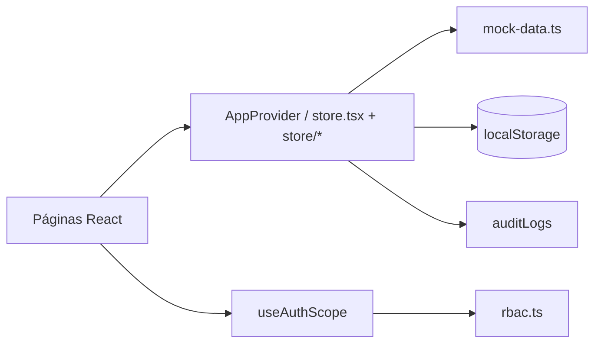

# Plataforma para Sistema Inteligente — MVP

**Navoxi** — plataforma corporativa de **gestão de aprendizagem, conteúdos e operações**. Este repositório contém um **MVP funcional** para demonstração de requisitos, fluxos de negócio e experiência de uso — com dados simulados e persistência local.

## Stack

| Camada | Tecnologia |
|---|---|
| Front | [Next.js 16](https://nextjs.org/) (App Router) + React 19 + TypeScript |
| Estilo | Tailwind CSS v4 |
| Estado UI | React Context (`src/lib/store.tsx` + `src/lib/store/*` por domínio) |
| Backend (Fase 1) | Java 21 + Spring Boot em [`backend/`](backend/) |
| Persistência API | H2 (local) / PostgreSQL + Flyway (prod) |
| Fallback demo | Mock em `src/lib/mock-data.ts` quando `NEXT_PUBLIC_USE_JAVA_API` ≠ `true` |

### Backend Java (opcional)

```bash
cd backend
mvn spring-boot:run -Dspring-boot.run.profiles=local
```

No front (`.env.local`):

```env
NEXT_PUBLIC_USE_JAVA_API=true
LMS_API_URL=http://localhost:8080
LMS_API_TOKEN=local-dev-token
AUTH_SECRET=dev-secret-change-me
LMS_SEED_PASSWORD=demo1234
AUTH_DEMO_ENABLED=true
```

O browser chama só `/api/lms/*` e `/api/auth/*` (BFF). O token Java nunca vai para o cliente.

Login por senha: `POST /api/auth/login` → backend Java (`BCrypt`). Fallback demo local só se `AUTH_DEMO_ENABLED=true` e o backend estiver indisponível.

Detalhes: [`backend/README.md`](backend/README.md).

## Início rápido

```bash
npm install
npm run dev
```

Abra [http://localhost:3000](http://localhost:3000). Com backend Java rodando, use e-mail cadastrado + senha seed (`LMS_SEED_PASSWORD`, default `demo1234`).

Build de produção:

```bash
npm run build
npm start
```

## Contas de demonstração

> **Somente desenvolvimento local** — profile `local`, `AUTH_DEMO_ENABLED=true`, seed ativo.

Senha inicial (usuários seed, profile `local`): `LMS_SEED_PASSWORD` / `demo1234`.

| E-mail | Perfil | Unidade |
|---|---|---|
| `ana.souza@navoxi.com` | Administrador Premium | Navoxi · Matriz |
| `bruno.ferreira@navoxi.com` | Administrador de Unidade | Navoxi · Matriz |
| `carla.mendes@navoxi.com` | Gestor de Conteúdo | Navoxi · Matriz |
| `henrique.castro@navoxi.com` | Instrutor | Navoxi · Matriz |
| `diego.alves@navoxi.com` | Aluno | Navoxi · Matriz |
| `felipe.rocha@navoxi.com` | Administrador de Unidade | Navoxi · Nordeste |

Em **produção pública**, login com essas contas é bloqueado (Next.js + backend Java). Botões de acesso rápido demo só aparecem com `AUTH_DEMO_ENABLED=true`.

### Checklist produção pública

- `AUTH_DEMO_ENABLED=false` (default em produção)
- `LMS_SEED_ENABLED=false`
- `LMS_BLOCK_DEMO_SEED_LOGINS=true` (default no profile `prod` do backend)
- `LMS_SEED_PASSWORD` forte ou seed desligado
- Microsoft Entra com tenant específico (`AZURE_AD_TENANT_ID`, não `common`)

O perfil e a unidade vêm do cadastro do usuário. Menus, rotas e dados são filtrados automaticamente conforme **RBAC** e escopo de unidade.

## Visão geral dos módulos

### Geral

| Rota | Descrição |
|---|---|
| `/dashboard` | KPIs, atalhos, destaques, filtros (unidade, categoria, público-alvo, modalidade), abas Dashboard / Equipe |
| `/notificacoes` | Central de notificações com detalhamento |
| `/perfil` | Dados do usuário autenticado |
| `/preferencias` | Tema, idioma e preferências de notificação |

### Administração e identidade

| Rota | Requisitos | Descrição |
|---|---|---|
| `/identidade` | Admin Premium | Perfis, matriz de permissões, políticas de segurança, sessões |
| `/administracao` | Admin Premium / Unidade | Gestão de usuários, busca, departamentos, cadastro |

### Aprendizagem

| Rota | Descrição |
|---|---|
| `/aprendizagem/catalogo` | Catálogo navegável + aba **Minhas inscrições** (matrículas e solicitações pendentes) |
| `/aprendizagem/cursos` | CRUD de cursos (publicar, arquivar, rascunho) + importação de aulas via YouTube |
| `/aprendizagem/cursos/[courseId]` | Player de aulas com vídeos YouTube (estilo biblioteca digital) e progresso por aula |
| `/aprendizagem/turmas` | Gestão de turmas vinculadas a cursos e salas |
| `/aprendizagem/trilhas` | Trilhas com etapas sequenciais e progresso |
| `/aprendizagem/calendario` | Calendário acadêmico de eventos |
| `/aprendizagem/biblioteca` | Biblioteca de materiais de aprendizagem |
| `/aprendizagem/salas` | Cadastro de salas e recursos presenciais |
| `/aprendizagem/certificados` | Emissão e gestão de certificados |
| `/aprendizagem/interesses` | Registro de interesse em cursos futuros |
| `/aprendizagem/solicitacoes` | Aprovação/rejeição de solicitações de matrícula |
| `/aprendizagem/avaliacoes` | Criação, edição e aplicação de avaliações |

**Modalidades suportadas:** EAD/online, presencial e híbrido.

**Fluxo de inscrição em cursos**

1. Aluno acessa **Catálogo** e clica em **Inscrever-se**.
2. Se o curso tiver turmas, seleciona a turma disponível (com verificação de vagas).
3. Com **aprovação obrigatória** ativa em Configurações → cria solicitação pendente.
4. Gestor aprova em **Solicitações** → matrícula efetivada e notificação enviada.
5. Sem aprovação → matrícula imediata, contadores de inscritos atualizados.
6. A aba **Inscrições** (`/aprendizagem/catalogo?tab=inscricoes`) lista matrículas ativas, concluídas e canceladas.
7. Alunos matriculados acessam **Continuar curso** → player em `/aprendizagem/cursos/[courseId]`; progresso = aulas concluídas ÷ total de aulas.

### Vídeos YouTube (importação de aulas)

Gestores podem importar playlists do YouTube na edição de um curso. A reprodução usa a YouTube IFrame Player API com títulos customizados da plataforma (sem exibir metadados do YouTube ao aluno).

Configure a chave da YouTube Data API v3 em `.env.local`:

```bash
YOUTUBE_API_KEY=sua_chave_aqui
```

Reinicie o servidor (`npm run dev`) após adicionar a variável. Sem a chave, o player de aulas seed continua funcionando; apenas a importação de novas playlists fica indisponível.

### Login com Microsoft (Entra ID)

Na tela de login há a opção **Entrar com Microsoft**, com identidade verificada via OAuth 2.0 e Microsoft Graph.

No [portal Azure](https://portal.azure.com) → **Microsoft Entra ID** → **Registros de aplicativo** → novo app:

1. **URI de redirecionamento (Web):** `https://seu-dominio/api/auth/microsoft/callback` (local: `http://localhost:3000/api/auth/microsoft/callback`)
2. Crie um **Segredo do cliente**
3. Permissões delegadas: `openid`, `profile`, `email`, `User.Read`

Variáveis em `.env.local` (e no Railway → Variables):

```bash
AZURE_AD_CLIENT_ID=seu_client_id
AZURE_AD_CLIENT_SECRET=seu_client_secret
AZURE_AD_TENANT_ID=common
AUTH_SECRET=string_aleatoria_longa
NEXT_PUBLIC_APP_URL=https://neoenergia-lms-production.up.railway.app
```

`AZURE_AD_TENANT_ID=common` aceita contas Microsoft corporativas e pessoais; use o ID do tenant da organização para restringir ao domínio da empresa.

### Conteúdo e avaliações

| Rota | Descrição |
|---|---|
| `/repositorio` | Upload e gestão de conteúdos (vídeo, PDF, SCORM, imagem, link) com campo de uso |
| `/repositorio/questoes` | Banco de questões (múltipla escolha, verdadeiro/falso, dissertativa) |

### Comunicação

| Rota | Descrição |
|---|---|
| `/comunicacao` | Destaques, posts, notificações, alertas, correio interno e campanhas multicanal |

O banner de destaques no dashboard pode ser ligado/desligado em **Configurações → Interface**.

### Inteligência e sistema

| Rota | Descrição |
|---|---|
| `/relatorios` | KPIs, gráficos de matrícula, conclusão e perfis |
| `/configuracoes` | Parâmetros gerais, módulos, interface, integrações, permissões, jobs agendados |
| `/integracoes` | SSO, RH, BI, webhooks, automações e jobs |
| `/auditoria` | Trilha de auditoria com filtros por severidade |

## Controle de acesso (RBAC)

Definido em `src/lib/rbac.ts`. Cada perfil possui um conjunto de permissões; rotas e itens de menu exigem permissões específicas.

| Perfil | Escopo principal |
|---|---|
| **Administrador Premium** | Todas as unidades, configurações globais, identidade, integrações, auditoria |
| **Administrador de Unidade** | Usuários, turmas, conteúdos e relatórios da própria unidade |
| **Gestor de Conteúdo** | Repositório, cursos e consumo de aprendizagem |
| **Instrutor** | Cursos, turmas e consumo de aprendizagem |
| **Aluno** | Catálogo, inscrições, trilhas, calendário e biblioteca |

**Unidades:** Navoxi · Matriz, Nordeste, Sul e Centro-Oeste.

O hook `useAuthScope()` (`src/lib/use-auth-scope.ts`) aplica o filtro por unidade nos dados retornados ao componente.

## Parametrização da plataforma

Em `/configuracoes` é possível alterar (persistido no estado da aplicação):

- Nome da organização, idioma, fuso horário
- Regras de segurança (MFA, tamanho mínimo de senha)
- **Aprovação de matrícula** (`approvalRequired`) — impacta o fluxo de inscrição
- Identidade visual (cor da marca)
- **Módulos habilitados** — ocultam itens do menu lateral
- **Layout** — sidebar ou menu superior, densidade, exibição de destaques
- Matriz de permissões por perfil
- Jobs agendados (sincronização RH, lembretes, relatórios)

## Arquitetura

```
src/
├── app/
│   ├── login/                      # Autenticação (demo por e-mail)
│   ├── page.tsx                    # Redirecionamento para login ou dashboard
│   └── (app)/                      # Shell autenticado (sidebar + header)
│       ├── dashboard/
│       ├── identidade/
│       ├── administracao/
│       ├── aprendizagem/           # 12 sub-rotas (catálogo, cursos, turmas…)
│       ├── repositorio/
│       ├── comunicacao/
│       ├── relatorios/
│       ├── configuracoes/
│       ├── integracoes/
│       ├── auditoria/
│       ├── notificacoes/
│       ├── perfil/
│       └── preferencias/
├── components/
│   ├── Sidebar.tsx                 # Navegação lateral (padrão)
│   ├── TopNav.tsx                  # Navegação superior (opcional)
│   ├── Header.tsx
│   ├── RouteGuard.tsx              # Proteção de rotas por permissão
│   ├── ui.tsx                      # Modal, Button, Card, Table…
│   ├── dashboard/                  # Filtros, widgets, aba Equipe
│   └── home/                       # Atalhos, destaques, ações rápidas
└── lib/
    ├── types.ts                    # Tipos de domínio
    ├── mock-data.ts                # Seed de demonstração
    ├── store.tsx                   # Fachada AppProvider / useApp
    ├── store/                      # Domínios: auth, learning, notifications
    │   ├── types.ts
    │   ├── shared.ts
    │   ├── use-auth-store.ts
    │   ├── use-learning-store.ts
    │   └── use-notifications-store.ts
    ├── rbac.ts                     # Perfis, permissões, menu
    ├── use-auth-scope.ts           # Escopo por unidade/perfil
    ├── aprendizagem.ts             # Labels (modalidade, status…)
    ├── dashboard-metrics.ts        # Cálculo de KPIs do dashboard
    └── platform-config.ts          # Tema / cor da marca
```

### Fluxo de dados



Toda mutação relevante (criar curso, inscrever aluno, alterar configuração) atualiza o estado em memória e registra entrada na **Auditoria**.

## Entidades principais (mock)

| Entidade | Uso |
|---|---|
| `User` | Colaboradores e perfis de acesso |
| `Course` / `Turma` / `Trilha` | Oferta de aprendizagem |
| `InscricaoCurso` | Matrículas efetivadas |
| `SolicitacaoMatricula` | Pedidos aguardando aprovação |
| `Certificado` | Emissão pós-conclusão |
| `Question` / `Evaluation` | Avaliações vinculadas a curso/turma |
| `ContentAsset` | Repositório de mídias |
| `Post` / `Destaque` / `InternalMail` | Comunicação interna |
| `Integration` / `Automation` / `ScheduledJob` | Integrações e automações |
| `AuditLog` / `Notification` | Auditoria e alertas |

## Limitações do MVP

Este projeto é uma **prova de conceito front-end**. Não há backend real, banco de dados nem integrações externas funcionais.

| Aspecto | Estado atual |
|---|---|
| Autenticação | Senha BCrypt (backend) + Microsoft Entra (whitelist) |
| Persistência | Sessão e preferências em `localStorage`; demais dados resetam ao recarregar* |
| Upload de arquivos | Simulado (metadados apenas) |
| E-mail / push / SMS | Simulados na UI |
| Integrações SSO/RH/BI | Status mock; toggles alteram apenas o estado local |

\* *O estado React persiste durante a sessão do navegador; ao fechar a aba ou limpar storage, os dados voltam ao seed.*

## Caminho para produção

1. **API** — Next.js Route Handlers ou serviço dedicado com banco relacional (PostgreSQL).
2. **Autenticação** — SSO corporativo (SAML/OIDC) e gestão de sessão server-side.
3. **RBAC** — Permissões avaliadas no servidor, não apenas no cliente.
4. **Integrações** — SuccessFactors/RH, Power BI, webhooks de certificados.
5. **Storage** — S3 ou equivalente para conteúdos e certificados PDF.
6. **Filas** — Jobs agendados (lembretes, sincronização, relatórios) via worker/cron.

## Scripts npm

| Comando | Ação |
|---|---|
| `npm run dev` | Servidor de desenvolvimento |
| `npm run build` | Build de produção |
| `npm start` | Servidor de produção |
| `npm run lint` | ESLint |

## Repositório

Código-fonte: [github.com/GrigoriDevv/navoxi-lms](https://github.com/GrigoriDevv/navoxi-lms)

---

**Plataforma para Sistema Inteligente · Navoxi** · MVP demonstrativo · Junho/2026
