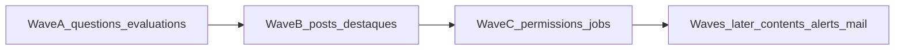

# FE-5 — Migrar módulos mock para API Java

Parecer e playbook. Card Trello: **\[FE-5\] Migrar módulos mock restantes para API Java (conforme backend evoluir)**.

Cada slice migrado **sai da lista FE-1** em [`AGENTS.md`](../AGENTS.md) e passa a `useQuery` / `useMutation` no padrão **FE-2** (`src/lib/lms/`).

**Este documento não implementa endpoints nem hooks RQ.** Só define inventário, contratos mínimos e o checklist quando o Spring ganhar a API.

## Bloqueio atual (backend)

Controllers em `backend/src/main/java/com/navoxi/lms/web/` hoje:

| Controller | Domínio |
|---|---|
| `AuthController` | login / JWT |
| `CourseController` | cursos |
| `CatalogController` / `LessonController` | módulos e aulas |
| `EnrollmentController` / `EnrollmentRequestController` | matrículas |
| `UserController` / `AdminUsersController` | usuário atual + admin users |
| `HealthController` / notificações | health + inbox |

**Ausentes:** `Question`, `Evaluation`, `Post`, `Destaque`, `Permission` (CRUD de matriz), `ScheduledJob`, e os demais FE-1 (`ContentAsset`, `AlertRule`, `InternalMail`, `Automation`, `Integration`).

Sem esses endpoints, o front **não** deve inventar RQ/BFF vazios.

## Inventário FE-1 restante

Estado no store: [`src/lib/store.tsx`](../src/lib/store.tsx) — slices marcados `// MOCK: not wired to backend`. Tipos em [`src/lib/types.ts`](../src/lib/types.ts). Seed em `src/lib/mock-data`.

Gates de rota em prod: [`src/lib/mock-module-gates.ts`](../src/lib/mock-module-gates.ts) (`MOCK_ONLY_PATHS` + escape `NEXT_PUBLIC_SHOW_MOCK_MODULES`).

| Slice | Hook / origem (hoje) | Rotas UI principais | Gate prod | API Java |
|---|---|---|---|---|
| `questions` | `store.tsx` → `useApp` / `useAuthScope` | `/repositorio/questoes` | (não em `MOCK_ONLY_PATHS`; dados mock) | **missing** |
| `evaluations` | idem | `/aprendizagem/avaliacoes` | `MOCK_ONLY_PATHS` | **missing** |
| `posts` | idem | `/comunicacao` | `MOCK_ONLY_PATHS` | **missing** |
| `destaques` | idem | `/comunicacao` | `MOCK_ONLY_PATHS` | **missing** |
| `permissions` | idem | `/configuracoes`, `/identidade` | `configuracoes` gated | **missing** |
| `scheduledJobs` | idem | `/configuracoes`, `/integracoes` | ambos gated | **missing** |
| `contents` | idem | `/repositorio` | (dados mock) | **missing** |
| `alertRules` | idem | `/comunicacao` | gated | **missing** |
| `internalMails` | idem | `/comunicacao` | gated | **missing** |
| `automations` | idem | `/integracoes` | gated | **missing** |
| `integrations` | idem | `/integracoes` | gated | **missing** |

> Se o PR **FE-4** (domain hooks) já estiver merged, os slices passam a viver em `use-repository-store` / `use-communication-store` / `use-admin-store`. O playbook abaixo continua válido: o ponto de wiring é o domain hook, não a página.

## Ordem do card (waves)



### Wave A — repositório (prioridade 1)

| Recurso | Contrato mínimo Spring (`/api/v1/...`) |
|---|---|
| Questions | `GET/POST /questions`, `GET/PATCH/DELETE /questions/{id}` |
| Evaluations | `GET/POST /evaluations`, `GET/PATCH /evaluations/{id}`, ação apply (ex.: `POST /evaluations/{id}/apply`) |

Shapes de referência FE: `Question`, `Evaluation` em `src/lib/types.ts` (`unitId`, `questionIds`, status, etc.). Preferir DTOs alinhados a esses campos para evitar remap pesado.

### Wave B — comunicação (prioridade 2)

| Recurso | Contrato mínimo |
|---|---|
| Posts | `GET/POST /posts`, `PATCH /posts/{id}` |
| Destaques | `GET/POST /destaques`, `PATCH /destaques/{id}` |

### Wave C — admin (prioridade 3)

| Recurso | Contrato mínimo |
|---|---|
| Permissions | `GET /permissions`, `PATCH /permissions/{id}` (roles) |
| Scheduled jobs | `GET /scheduled-jobs`, `PATCH /scheduled-jobs/{id}` (enable / schedule) |

### Fora de escopo imediato (waves seguintes)

`contents`, `alertRules`, `internalMails`, `automations`, `integrations` — depois das três waves do card, mesmo playbook.

## Padrão FE-2 (referência)

Já em produção para aprendizagem core:

| Peça | Onde |
|---|---|
| Query keys | [`src/lib/lms/query-keys.ts`](../src/lib/lms/query-keys.ts) (`lmsKeys`) |
| Hooks | `src/lib/lms/use-courses.ts`, `use-catalog.ts`, … |
| Client | [`src/lib/api-client.ts`](../src/lib/api-client.ts) (`lmsApi` + BFF `/api/lms/*`) |
| BFF proxy | [`src/app/api/lms/[...path]/route.ts`](../src/app/api/lms/[...path]/route.ts) |
| Wiring store | [`src/lib/store/use-learning-store.ts`](../src/lib/store/use-learning-store.ts): `javaApi` → RQ; senão seed |
| Flag | `NEXT_PUBLIC_USE_JAVA_API=true` |

Exemplo de hook:

```ts
// padrão: enabled só com Java API
return useQuery({
  queryKey: lmsKeys.questions(),
  queryFn: () => lmsApi.listQuestions(),
  enabled: isJavaApiEnabled(),
});
```

## Playbook por wave (quando a API existir)

Executar **nesta ordem** num PR (ou duo BE+FE linkados):

1. **Backend** — Flyway + entity/repo + service + controller + `PreAuthorize` / escopo de unidade (mesmo padrão de courses/enroll). Testes JUnit mínimos (list + create + authz).
2. **Contrato** — paths e DTOs estáveis sob `/api/v1/...` (documentar no PR).
3. **FE client** — métodos em `lmsApi` (`list` / `create` / `update` / ações).
4. **Query keys** — entradas em `lmsKeys` + helpers de invalidate em `src/lib/lms/invalidate.ts`.
5. **Hooks** — `src/lib/lms/use-questions.ts` (etc.), export em `src/lib/lms/index.ts`.
6. **BFF** — o catch-all `[...path]` já encaminha; só criar rota dedicada se precisar de reshape.
7. **Store** — no composer / domain hook: se `isJavaApiEnabled()`, dados e mutações via RQ; senão manter seed. Remover `// MOCK` do slice migrado.
8. **AGENTS.md** — tirar o slice da tabela FE-1; mover para a coluna Java/BFF.
9. **Gates** — em `mock-module-gates.ts`, remover path de `MOCK_ONLY_PATHS` **somente** se a UI da rota estiver 100% no slice migrado (ex.: Wave A → `/aprendizagem/avaliacoes`; Wave B → reavaliar `/comunicacao` se ainda tiver alertRules/mail mock).
10. **README** — atualizar linha na tabela “Limitações do MVP” se o módulo deixar de ser demo.

## Definition of done por slice

- [ ] Endpoints Spring respondem com auth + escopo de unidade
- [ ] `lmsApi` + `lmsKeys` + `useQuery` / `useMutation`
- [ ] Store: Java on → RQ; Java off → seed (sem regressão local)
- [ ] Comentário `// MOCK` removido desse slice
- [ ] Entrada FE-1 removida / atualizada em `AGENTS.md`
- [ ] Gate de rota ajustado se aplicável
- [ ] Smoke: list + create/update (e apply em evaluations)
- [ ] Teste de keys / invalidate (padrão dos testes FE-2 existentes, se houver)

## O que não fazer

- Scaffold de controller/RQ sem persistência real
- Migrar UI sem backend da wave
- Big-bang de todos os 11 slices num único PR
- Abrir rota em prod enquanto qualquer dado crítico da página ainda for seed

## Próximo PR de código

Quando **Wave A** existir no Spring: branch FE `feat/fe-5-wave-a-questions-evaluations` seguindo este playbook. Waves B e C em PRs separados.
