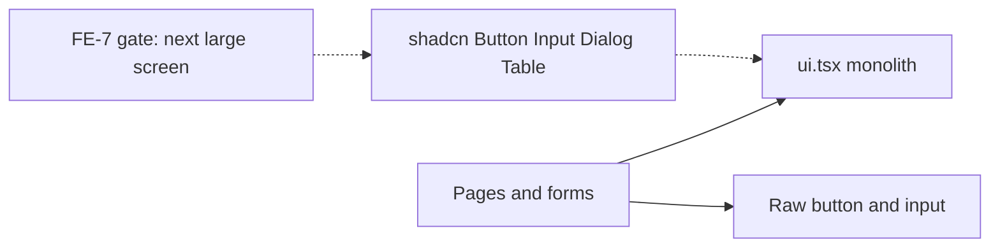

# FE-7: Avaliação — `ui.tsx` → kit componível (shadcn/ui)

**Status:** parecer (sem migração de código neste card)  
**Prioridade:** P2 · esforço grande · sem deadline  
**Gatilho de execução:** próxima **tela grande** nova (ou redesign visual explícito)

## Decisão

Adotar **shadcn/ui de forma incremental**. Não fazer big-bang.

- [`src/components/ui.tsx`](../src/components/ui.tsx) permanece a fachada pública (`@/components/ui`) enquanto as waves avançam.
- Waves **1–4** (Button → Input → Dialog → Table) só começam quando o gatilho abaixo for verdadeiro.
- `Card`, `StatCard`, `PageHeader`, `Avatar`, `ProgressBar`, `Badge` **não** entram no wave 1 — são layout LMS; migrar só se tocados por necessidade.

## Inventário (`src/components/ui.tsx`, ~247 linhas)

Contagens aproximadas no repo (branch de avaliação):

| Métrica | Valor |
|---------|------:|
| Arquivos que importam `@/components/ui` | ~39 |
| Arquivos que importam `Button` do kit | ~19 |
| Ocorrências de `<button` cru | ~76 |
| Arquivos com `Modal` | ~16 |
| Arquivos com `Table` | ~17 |
| Arquivos com `inputClass` | ~18 |

Não existe `components.json` nem pasta `src/components/ui/` no estilo shadcn hoje.

| Export | Papel hoje | Gaps / inconsistências |
|--------|------------|-------------------------|
| `Button` | `primary` \| `outline` | Sem `disabled`, `size`, `className`; muitas UIs usam `<button>` cru (login, Header, player) |
| `Field` + `inputClass` | Label + string CSS para input/select/textarea | Não há componente `Input`; sem estados error/disabled |
| `Modal` | Overlay + painel | Sem focus trap, ESC, portal, `aria-*`; API ≠ Radix Dialog |
| `Table` | `head: string[]` + `children` | Sem sort/sticky/empty; API rígida |
| `Badge` | Cores nomeadas | `color="green"` usa classes **sky** (inconsistência visual) |
| `Card`, `StatCard`, `PageHeader`, `Avatar`, `ProgressBar` | Layout LMS | Manter como wrappers de produto |

## Ordem de migração (obrigatória)

### Wave 1 — Button

1. Setup shadcn (`components.json`, deps Radix/`class-variance-authority`/`clsx`/`tailwind-merge` conforme CLI).
2. `npx shadcn@latest add button` → `src/components/ui/button.tsx`.
3. Em `ui.tsx`, `Button` reexporta o primitivo com mapa:
   - `variant="primary"` → shadcn `default` (ou variante visual alinhada ao gradiente atual)
   - `variant="outline"` → `outline`
4. Aceitar `disabled` (e idealmente `className`).
5. Piloto: **somente a nova tela grande** + 1–2 call sites tocados; não varrer o repo.

### Wave 2 — Input

1. `npx shadcn@latest add input` (+ `label` se útil).
2. `Field` / `inputClass` passam a compor o primitivo (manter `inputClass` como alias temporário se precisar).
3. Migrar forms da **nova tela** primeiro; pages mock antigas só quando editadas.

### Wave 3 — Dialog

1. `npx shadcn@latest add dialog`.
2. Nova tela usa Dialog; manter export `Modal` como alias fino (`open`/`onClose`/`title`) até zerar usos.
3. Não misturar Modal legado e Dialog na mesma feature sem o alias.

### Wave 4 — Table

1. `npx shadcn@latest add table`.
2. Listagens **novas** usam primitives (`Table`, `TableHeader`, `TableRow`, …).
3. Tabelas antigas (`head: string[]`) só quando a página for tocada.

## Critério de gatilho (quando começar Wave 1)

Iniciar **somente** se:

1. Nova rota/página “grande”: ≥1 formulário **e** (lista **ou** dialog), **ou**
2. Produto pedir redesign visual explícito do kit.

Fora disso: este documento basta; não instalar shadcn “por precaução”.

## Anti-padrões

- Não migrar login / Microsoft Entra / SSO só por estética.
- Não big-bang em dezenas de páginas mock.
- Não trocar tokens/tema global neste card.
- Não migrar Badge/Card/StatCard no wave 1.

## Próximos PRs (fora deste card)

| PR | Conteúdo |
|----|----------|
| Wave 1 | Setup shadcn + Button + tela piloto |
| Wave 2 | Input + forms da mesma feature |
| Wave 3 | Dialog substituindo Modal na feature |
| Wave 4 | Table na listagem nova |

## Checklist de aceite deste parecer

- [x] Inventário de primitivos e gaps
- [x] Ordem Button → Input → Dialog → Table
- [x] Gatilho “nova tela grande” documentado
- [x] Sem instalação shadcn / sem rewrite de páginas neste PR
